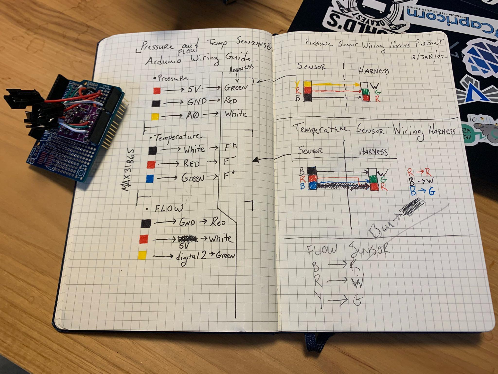

# Arduino Water System Monitoring

`sensors.ino`contains the necessary code for monitoring water pressure, temperature and flow.  

- [Flow sensor](https://www.amazon.com/gp/product/B07QQWBPKC/ref=ppx_yo_dt_b_search_asin_title?ie=UTF8&th=1) (Hall effect sensor)

- [Gravity: Analog Water Pressure Sensor - DFRobot](https://www.dfrobot.com/product-1675.html)

- [PT100 Temperature Sensor](https://www.amazon.com/gp/product/B071DW3GVQ/ref=ppx_yo_dt_b_search_asin_title?ie=UTF8&psc=1)
  
  - [PT100 MAX31865 RTD Temperature Thermocouple Sensor Amplifier Module](https://www.amazon.com/gp/product/B08216XVWX/ref=ppx_yo_dt_b_search_asin_title?ie=UTF8&psc=1)

All of the sensors were assembled onto an Arduino-compatible perma-shield.  [SM-3P 22 gauge connectors](https://www.amazon.com/gp/product/B09MVFPD7X/ref=ppx_yo_dt_b_search_asin_title?ie=UTF8&th=1) were used to connect sensors to the shield.

Connection and hookup notes.

